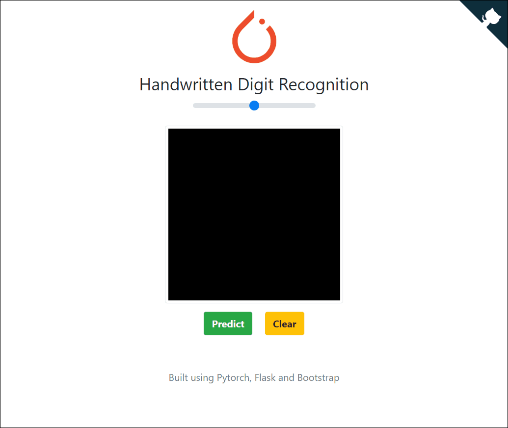

# PyTorch-CNN-MNIST
This repo contains a sample code to show how to create a cnn model using pytorch and trained on the mnist.
## Demo
> [http://pytorch-cnn-mnist.herokuapp.com/](http://pytorch-cnn-mnist.herokuapp.com/)


## Install
Install `pytorch` and other necessary module (`tensorboard` and `matplotlib`).
```bash
pip install -r requirements.txt
```
## Train
Run [train.py](train.py) to train your cnn model on mnist dataset.
```bash
python train.py
```
## Test
Run [test.py](test.py) to test the trained model on your own handwritten digit.
```bash
python test.py
```
## Deploy
[](https://heroku.com/deploy?template=https://github.com/XavierJiezou/pytorch-cnn-mnist/tree/deploy)
1. register an account of [heruku](https://www.heroku.com/)
2. create an `app` on heruku
3. push the `deploy` folder to heroku master
## Blog
Learn more about training, read the following article written in Chinese
> [https://blog.csdn.net/qq_42951560/article/details/109565625](https://blog.csdn.net/qq_42951560/article/details/109565625)
## Cite
```
https://github.com/avinassh/pytorch-flask-api-heroku
https://pytorch.org/tutorials/beginner/blitz/cifar10_tutorial.html
```